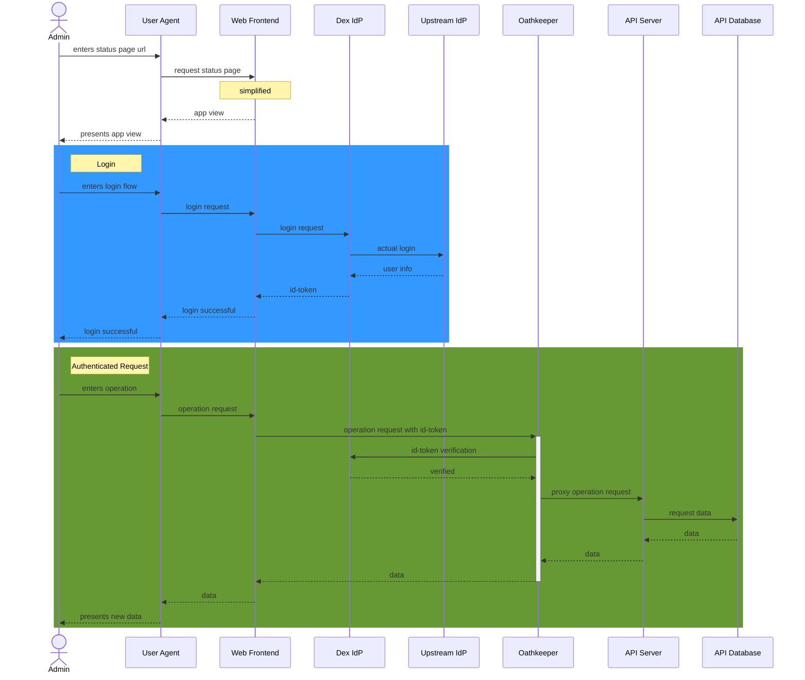

# Admin authentication

As the write operations of the [API server](https://github.com/SovereignCloudStack/status-page-api) are protected by [Oathkeeper](https://www.ory.sh/docs/oathkeeper) and use identities provided by [Dex](https://dexidp.io/) an Administrator is considered to be a person that can authenticate on Dex.

On the public SCS deployment, these persons are members of the SovereignCloudStack organization.

This sequence diagram displays a simplified flow how an administrator authenticates himself with Dex and GitHub, to authorize using the write operations.

