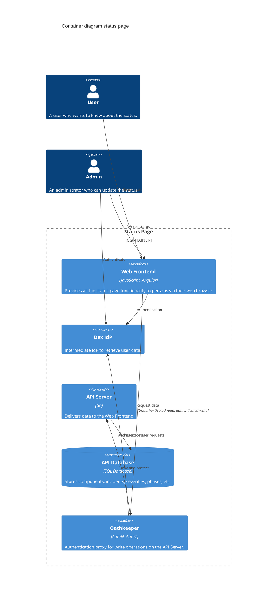

# Overview

```mermaid
    C4Container
    title Container diagram status page

    Person(user, User, "A user who wants to know about the status.")
    Person(admin, Admin, "An administrator who can update the status.")

    Container_Boundary(status-page, "Status Page") {
        Container(web, "Web Frontend", "JavaScript, Angular", "Provides all the status page functionality to persons via their web browser")
        Container(dex, "Dex IdP", "", "Intermediate IdP to retrieve user data.")
        Container(api, "API Server", "Go", "Delivers data to the Web Frontend")
        ContainerDb(api-db, "API Database", "SQL Database", "Stores components, incidents, severities, phases, etc.")
        Container(oathkeeper, "Oathkeeper", "AuthN, AuthZ", "Authentication proxy for write operations on the API Server.")

        Rel(api, api-db, "Request data")
        Rel(web, oathkeeper, "Request data", "Unauthenticated read, authenticated write")
        Rel(oathkeeper, api, "Proxy and protect",)
        Rel(web, dex, "Authentication")
        Rel(oathkeeper, dex, "Authenticate user requests")
    }

    Rel(user, web, "Reads status")
    Rel(admin, web, "Writes status")
    Rel(admin, dex, "Authenticate")

```
