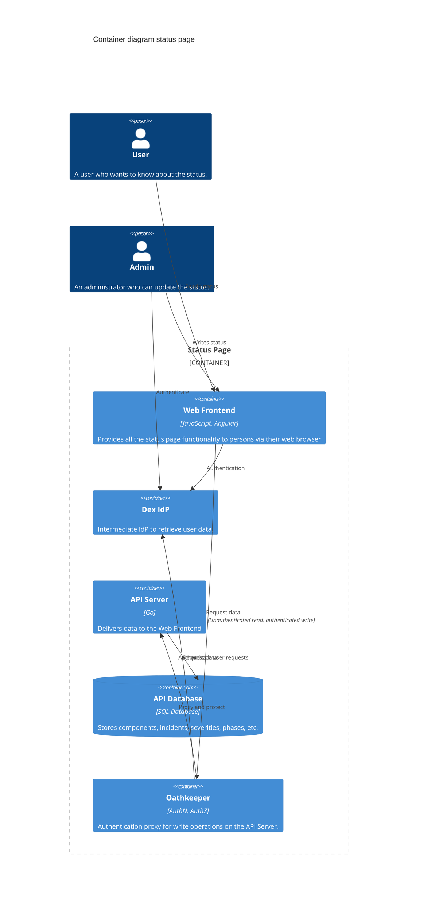
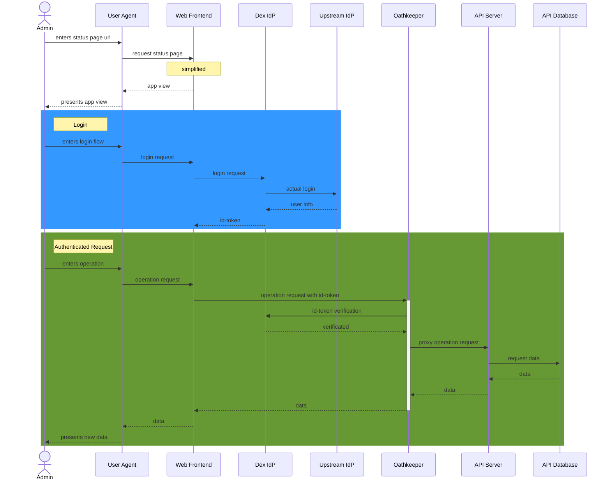

# Overview

## Container view

```mermaid
    C4Container
    title Container diagram status page

    Person(user, User, "A user who wants to know about the status.")
    Person(admin, Admin, "An administrator who can update the status.")

    Container_Boundary(status-page, "Status Page") {
        Container(web, "Web Frontend", "JavaScript, Angular", "Provides all the status page functionality to persons via their web browser")
        Container(dex, "Dex IdP", "", "Intermediate IdP to retrieve user data.")
        Container(api, "API Server", "Go", "Delivers data to the Web Frontend")
        ContainerDb(api-db, "API Database", "SQL Database", "Stores components, incidents, severities, phases, etc.")
        Container(oathkeeper, "Oathkeeper", "AuthN, AuthZ", "Authentication proxy for write operations on the API Server.")

        Rel(api, api-db, "Request data")
        Rel(web, oathkeeper, "Request data", "Unauthenticated read, authenticated write")
        Rel(oathkeeper, api, "Proxy and protect",)
        Rel(web, dex, "Authentication")
        Rel(oathkeeper, dex, "Authenticate user requests")
    }

    Rel(user, web, "Reads status")
    Rel(admin, web, "Writes status")
    Rel(admin, dex, "Authenticate")

```

## Sequence view

```mermaid
sequenceDiagram
actor admin as Admin
participant useragent as User Agent
participant web as Web Frontend
participant dex as Dex IdP
participant idp as Upstream IdP
participant oathkeeper as Oathkeeper
participant api as API Server
participant db as API Database

admin->>useragent: enters status page url
useragent->>web: request status page
note over web: simplified
web-->>useragent: app view
useragent-->>admin: presents app view

rect rgba(0,127,255,0.8)
    note right of admin: Login
    admin->>useragent: enters login flow
    useragent->>web: login request
    web->>dex: login request
    dex->>idp: actual login
    idp-->>dex: user info
    dex-->>web: id-token
end

rect rgba(64,127,0, 0.8)
    note right of admin: Authenticated Request
    admin->>useragent: enters operation
    useragent->>web: operation request
    web->>+oathkeeper: operation request with id-token
    oathkeeper->>dex: id-token verification
    dex-->>oathkeeper: verificated
    oathkeeper->>api: proxy operation request
    api->>db: request data
    db-->>api: data
    api-->>oathkeeper: data
    oathkeeper-->>-web: data
    web-->>useragent: data
    useragent-->>admin: presents new data
end

```
