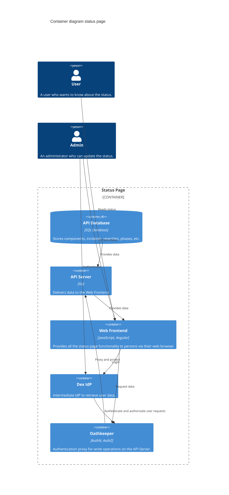

# Overview

```mermaid
    C4Container
    title Container diagram status page

    Person(user, User, "A user who wants to know about the status.")
    Person(admin, Admin, "An administrator who can update the status.")

    Container_Boundary(status-page, "Status Page") {
        ContainerDb(api-db, "API Database", "SQL Database", "Stores components, incidents, severities, phases, etc.")
        Container(api, "API Server", "Go", "Delivers data to the Web Frontend")
        Container(web, "Web Frontend", "JavaScript, Angular", "Provides all the status page functionality to persons via their web browser")
        Container(dex, "Dex IdP", "", "Intermediate IdP to retrieve user data.")
        Container(oathkeeper, "Oathkeeper", "AuthN, AuthZ", "Authentication proxy for write operations on the API Server.")

        Rel(api, web, "Provides data")
        Rel(api-db, api, "Provides data")
        Rel(web, oathkeeper, "Request data")
        Rel(oathkeeper, api, "Proxy and protect")
        Rel(web, dex, "Login")
        Rel(dex, oathkeeper, "Authenticate and authorizate user requests")
    }

    Rel(user, web, "Reads status")
    Rel(admin, web, "Writes status")
    Rel(admin, dex, "Authenticate")

```
